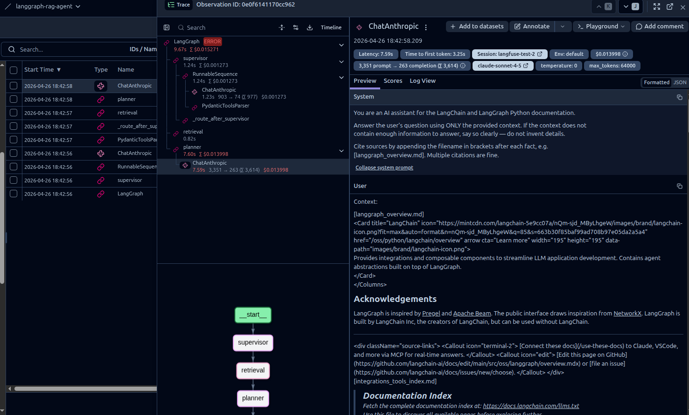

# langgraph-rag-agent

Multi-agent RAG system built with LangGraph — supervisor, retrieval, planner, and verifier nodes with checkpointing and human-in-the-loop interrupts. Targeting AWS Lambda deployment with Langfuse tracing.

> **Status:** Day 1 of 3 complete. Single-line graph (`retrieval → planner`) running locally with streaming and citations. Day 2 adds supervisor, verifier loop, checkpointing, and HITL.

## Architecture

**Today (Day 1):**

```
            ┌──────────────┐         ┌──────────────┐
   query ─▶ │  retrieval   │  ─────▶ │   planner    │ ─▶ streamed answer
            │  ChromaDB    │  docs   │  Claude 4.5  │    with citations
            └──────────────┘         └──────────────┘
```

**Target (after Day 2):**

```
                     ┌──────────────┐
              user ─▶│  supervisor  │   classifies query (Haiku)
                     └──────┬───────┘
                            │
              ┌─────────────┴─────────────┐
              ▼                           ▼
       ┌──────────────┐            ┌──────────────┐
       │  retrieval   │            │   direct     │   simple Qs skip
       │  ChromaDB    │            │   answer     │   retrieval entirely
       └──────┬───────┘            └──────┬───────┘
              │                           │
              ▼                           │
       ┌──────────────┐                   │
       │   planner    │ ◀─────────────────┘
       │  Claude 4.5  │
       └──────┬───────┘
              │
              ▼
       ┌──────────────┐
       │   verifier   │   max 3 iterations
       └──────┬───────┘   HITL interrupt on low confidence
              ▼
            user
```

## Stack

| Component | Tool | Purpose |
|---|---|---|
| Language | Python 3.12 | LangGraph's primary SDK |
| Orchestration | **LangGraph 1.x** | Multi-node agent graph |
| Vector DB | **ChromaDB** (local file mode) | Embedding storage + similarity search |
| Planner LLM | **Claude Sonnet 4.5** (Anthropic API) | Answer generation |
| Embeddings | **OpenAI `text-embedding-3-small`** | Query/chunk vectors |
| Observability | **Langfuse** | Prompt-level tracing, cost, latency |
| Deployment *(Day 3)* | **AWS Lambda + API Gateway** | Serverless inference |
| CI/CD *(Day 3)* | **GitHub Actions** | Eval-gated deploys |

## Corpus

The agent answers from a 168-page corpus of public LangChain + LangGraph Python documentation, pulled via the official `llms.txt` index and Mintlify's markdown mode.

The `corpus/` and `chroma_db/` directories are gitignored — rebuild locally with the steps below.

## Setup

```bash
git clone https://github.com/nicolasjesse/langgraph-rag-agent
cd langgraph-rag-agent

python3 -m venv .venv
source .venv/bin/activate
pip install -r requirements.txt

cp .env.example .env
# Edit .env and set ANTHROPIC_API_KEY and OPENAI_API_KEY
```

Then build the local corpus + vector store (one-time, ~1 minute total):

```bash
python scrape_corpus.py    # downloads ~168 LangChain docs into corpus/
python ingest.py           # chunks (800-token / 100-overlap), embeds, stores in chroma_db/
```

## Usage

Ask a question — answer is streamed and grounded in retrieved chunks with filename citations:

```bash
python cli.py "What is LangGraph and how does it differ from LangChain?"
```

Inspect retrieval directly (no LLM call, useful for tuning chunking / `top_k`):

```bash
python query.py "How do I add memory to an agent?" -k 5
python query.py "streaming token by token" --full
```

## Tests

Mocked unit tests for the graph + nodes — run in <1s, no API keys needed:

```bash
python -m pytest tests/
```

Real-API + answer-quality coverage will live in `evals/` once Day 3 is complete.

## Observability

Every LLM call (supervisor, planner, verifier, direct_answer) is forwarded to
Langfuse via a single callback handler attached at the CLI driver. Traces are
tagged with `session_id = thread_id`, so multi-turn conversations group together
in the dashboard.



Set `LANGFUSE_PUBLIC_KEY` and `LANGFUSE_SECRET_KEY` in `.env` to enable. Without
them, the CLI runs unchanged — tracing is opt-in per environment.

## License

MIT
